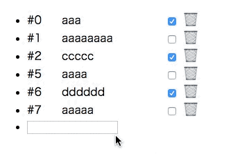
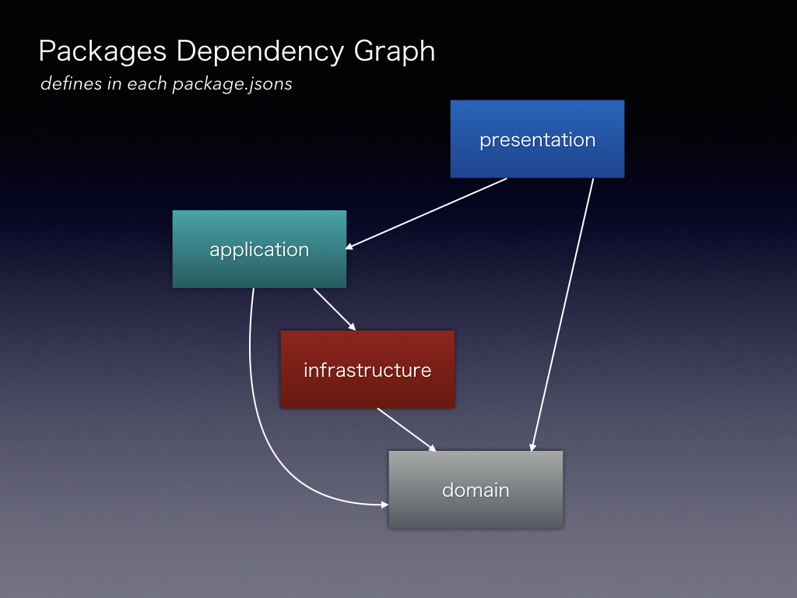

NkznTodo
==========

Layered Architecture based React application structure sample.



Samples
----------

* multi-package: punctuate Layered Architecture with monorepo.
* single-package: punctuate Layered Architecture with plain directory.

multi-package
----------

This sample uses monorepo with [lerna](https://github.com/lerna/lerna).

### structure

| package | description |
|---------|-------------|
| presentation-redux | create-react-app based TypeScript Web App |
| application | Application Service **(No Redux Dependencies)** |
| domain | Type Definition & Behavior Functions **(No Redux Dependencies)** |
| infrastructure | Dummy Networking **(No Redux Dependencies)** |

Monorepo structure with lerna allows us to build dependency graph between packages. `domain` is the most *pure* package, and `presentation` is most *complex* package. If you build all packages, lerna considers dependency. `lerna run ***` command executes commands in order of dependencies.



### Getting Started

At first, install with yarn.

```
$ yarn install
```

next, build TypeScript in the infrastructure, domain, application-redux.

```
$ yarn build:tsc
```

finally, start webapp in the presentation-redux.

```
$ cd packages/presentation-redux
$ yarn start
```

### Characteristic codes

* [TodoApplicationService](multi-package/packages/application/src/service/TodoApplicationService.ts)
    * [ActionDispatcher](https://qiita.com/uryyyyyyy/items/d8bae6a7fca1c4732696) Pattern based Application Service.
* [ducks/todoListState](multi-package/packages/presentation-redux/src/ducks/todoListState.ts)
    * Messaging & State handling between Application Service <=> Presentation

single-package
----------

### structure

The single-package punctuate Layered Architecture with plain directory.

This is **dangerous** structure because `domain` code can call `presentation` code.

### Getting Started

```
$ yarn install
$ yarn start
```

That's all!

donate
----------

Welcome!


